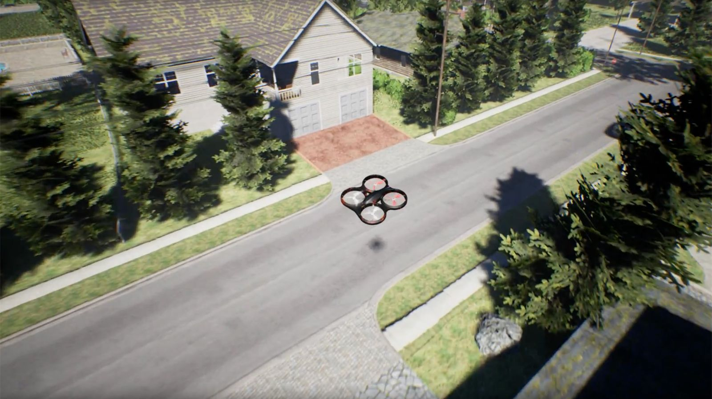
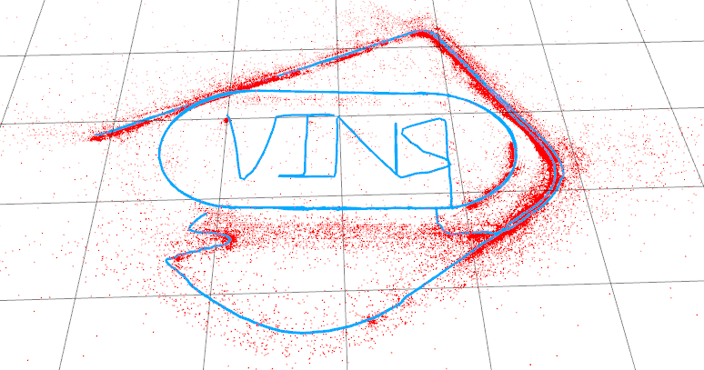
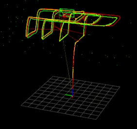
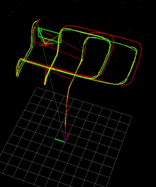
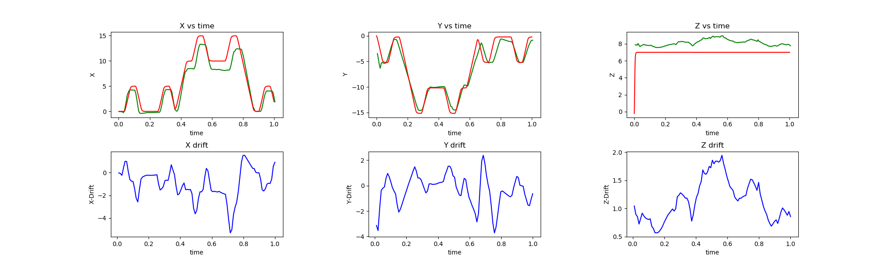
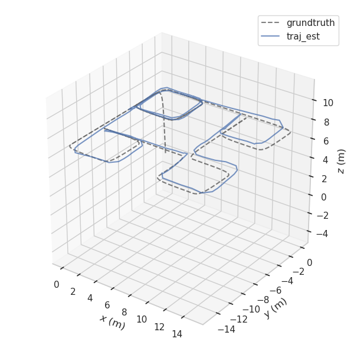
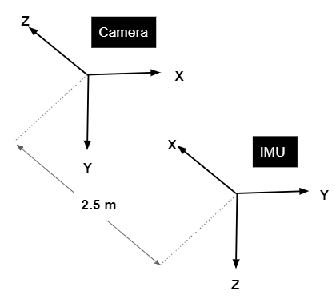

<h1 style="float:center">VINS-Mono on Airsim</h1>

<table>
<tr>
    <td><td>
    <td>
    
    </td>
</tr>
</table>

This repository aims to implement the state of the art monocular VI-SLAM, <a href="https://github.com/HKUST-Aerial-Robotics/VINS-Mono">VINS-Mono</a> over Microsoft virtual environment <a href="https://github.com/microsoft/AirSim">Airsim</a>. The whole setup runs on UnReal Engine4 and has been tested over Blocks environment.

## Building the packages

1. **_$ cd catkin_vins/src/Airsim/ && ./clean.sh && ./setup.sh_**
2. **_$ ./build && cd ../../../_**
3. **_$ cd catkin_vins && catkin build && cd .._**
4. **_$ sudo chmod +x run_all.sh_** 

## Running the package
**[NOTE]** : This package already runs binary located at ~/Airsim_Binaries/HiFi_3ftMarker/HiFi_3ftMarker/LinuxNoEditor/Blocks.sh, Feel free to change it to your binary

**Pre-requisite:** 

- install xterm to run following scripts
- put the settings.json file in Documents folder
- **_pip install -r requirements.txt_** (advisable to create a new conda environment)

**Command:**  
**_$ ./run_all.sh_**

**[NOTE]** : This script uses a pre-set navigation file (see last command in run_all script). In order to run with SITL, changing the Settings.json for blocks to operate on ArduPilot ports and then giving the navigation commands would do.

 

## Error Evaluation
Error  plots have been generated from [RPG_trajectory](https://github.com/uzh-rpg/rpg_trajectory_evaluation#single-trajectory-estimate) Github repository

1. Record a bag file while running the repository
2. ***$ python [bag2plots.py](bag2plots.py) <Address_to_bag_file>***

You'll have your plots at error_evaluation/plots

### Aligned Plots for a different trajectory looks like this

## Closing everything
**_$ killall xterm Blocks_**

*****

## Important parameters

All tunable parameters are placed in catkin_vins/src/config/airsim/airsim_config.yaml

These parameters are listed by the modules they'll be affecting

**Camera Module**

<table>
<tr>
<td>

* **Image width and height**: published images dimension must match the one in config file.

* **Distortion Parameter** : In traditional setting, they along with extruinsics, intrinsics are obtained by camera calibration. They are taken to be 0 for OpenGL based applications (Airsim).

* **Camera Intrinsic Parameters** : Intrinsic matrix of camera in use. For pinhole camera see [this](https://github.com/microsoft/AirSim/issues/314). For pin-hole camera model, it depends on image width, height, FOV. For this implementation FOV is set to 90 degrees.

* **Camera Extrinsic Matrix** (Rotation/Translation) : The relative position of IMU(body) from camera. It must be noted that camera's co-ordinate frame is rotated with respect to IMU/body's co-ordinate frame in airsim. The orientation for front camera with no pitch, roll, yaw is as shown:

</td>

<td>

</td>

</tr>
</table>

**Feature Tracking**

* **Maximum number of features** : Sets a high bar for selection fo features. This indirectly keeps the optimization algorithm in check.

* **Minimum Distance between features** : This parameter ensures that features are not detected in form of clusters and hence maintain sparcity of features selected for better motion approximation.

* **Frequency of publishing** : Sets a higher bar for sampling and publishing odometry data by the VINS system.

* **Ransac threshold** : Governs outlier rejection of features based on parallax difference

**Optimizer**

* **Maximum Solver time** : Keeps the algorithm real time and also affects highest sampling frequency that can be set.

* **Maximum Solver Iteration** : Same as above meanwhile putting a limit of accuracy attained.

* **Threshold Parallax difference** : Sets the minimum parallax difference for a new camera frame to be classified as keyframe

**IMU Pre-integration**

These all are initial estimates and would be updated as the drone moves.

* **IMU accelerometer bias estimate standard deviation** : std-deviation within which IMU's accelerometer bias is expected to lie.

* **IMU gyroscopic bias estimate standard deviation** : std-deviation within which IMU's gyroscopic bias is expected to lie.

* **IMU accelerometer noise standard deviation** : std-deviation within which IMU's accelerometer noise is expected to lie.

* **IMU gyroscopic noise standard deviation** : std-deviation within which IMU's gyroscopic noise is expected to lie.

* **Temporal calibration (td)** : Initial estimate of time delay between camera frame capture and corresponding IMU measurement record. (imu_timestamp - camera_timestamp)
***

## Possible errors and their solutions

* **Error** : Build error> different path in rpc_wrapper repository airsim
* **Solution** : Delete current build,devel,log directories. cd catkin_vins/src/Airsim && ./clean.sh && ./setup.sh && ./build.sh

* **Error** : Error in running move_on_path2.py or publish_path.py script
* **Solution** : Remove all versions of other dependencies (specially tornado), install only one version of all dependencies (for tornado it is 4.5.3. Tornado 6 is not supported)

* **Error** : No data recieved in VINS
* **Solution** : Check if published IMU and Image topic same as in catkin_vins/src/config/airsim/airsim_config.yaml

***
### Incase of any query please contact:

**Ritvik Pandey (Intern H402743)**

**7478006888**

ritvik.pandey03@gmail.com

###### This repository has been compiled for Honeywell India
